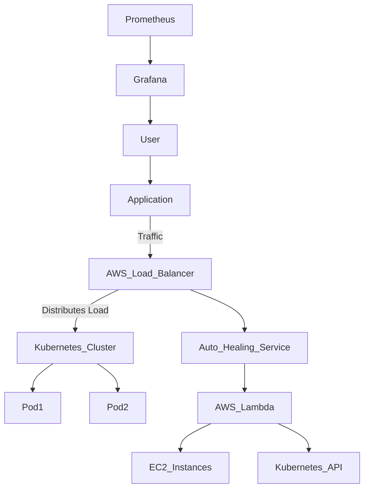

---

### 📌 **AI-Driven Auto-Healing Infrastructure**  

🔹 **Author:** SENTHIL RAJAN
🔹 **Technologies:** AWS, Terraform, Kubernetes, Prometheus, Grafana, Lambda, Python  
🔹 **Project Type:** DevOps | Cloud Automation | Infrastructure-as-Code  
🔹 **GitHub Repo:**   https://github.com/SENTHILRAJANSP6/AI-Driven-Auto-Healing-Infrastructure

---

## 🚀 **Project Overview**  
This project demonstrates an **AI-powered auto-healing infrastructure** that can detect failures in an AWS environment and automatically remediate them. The system continuously monitors EC2 instances, Kubernetes clusters, and other services, applying **self-healing mechanisms** without human intervention.  

---

## ⚡ **Key Features**  
✅ **Auto-Healing for EC2 & Kubernetes Nodes** – Monitors health and restarts failed instances  
✅ **AI-Powered Insights** – Uses ML-based anomaly detection for failure prediction  
✅ **Terraform for Infrastructure-as-Code** – Automates AWS resource provisioning  
✅ **Event-Driven Architecture** – AWS Lambda & CloudWatch for real-time event handling  
✅ **Centralized Monitoring** – Integrated with Prometheus & Grafana for visual insights  

---

## 🏗 **Project Architecture**  



---

## 🔧 **Tech Stack & Tools**  
- **Cloud Provider:** AWS (EC2, Lambda, CloudWatch, SNS)  
- **Container Orchestration:** Kubernetes (AWS EKS)  
- **Infrastructure-as-Code:** Terraform  
- **Monitoring & Logging:** Prometheus, Grafana, AWS CloudWatch  
- **AI/ML for Anomaly Detection:** Python, AWS SageMaker (optional)  
- **CI/CD:** GitHub Actions, Jenkins  

---

## 🛠 **Installation & Setup**  
### 1️⃣ Clone the Repository  
```sh
git clone https://github.com/SENTHILRAJANSP6/AI-Driven-Auto-Healing-Infrastructure.git
cd AI-Driven-Auto-Healing-Infrastructure
```

### 2️⃣ Deploy Infrastructure using Terraform  
```sh
terraform init
terraform apply -auto-approve
```

### 3️⃣ Configure Monitoring Stack  
- Deploy **Prometheus & Grafana** using Helm  
```sh
helm install monitoring-stack ./helm-chart
```

### 4️⃣ Deploy the Application  
```sh
kubectl apply -f deployment.yaml
```

### 5️⃣ Test Auto-Healing  
- Simulate failure by manually stopping an EC2 instance or Kubernetes node  
```sh
aws ec2 stop-instances --instance-ids i-XXXXXXXXXX
```
- Watch auto-recovery logs in **CloudWatch & Prometheus**  

---
 

---

## 🎯 **Future Enhancements**  
🚀 Implement AI-powered predictive failure detection  
🚀 Add multi-cloud support (Azure, GCP)  
🚀 Enhance CI/CD pipelines for automated deployments  

--- 

---

### ⭐ **If you find this useful, don’t forget to star the repo!** ⭐  

---

### 📞 **Connect with Me**  
🔗 LinkedIn: www.linkedin.com/in/senthil-rajan-8b7b692a3 
📧 Email: senthilrajansp@gmail.com 

---
